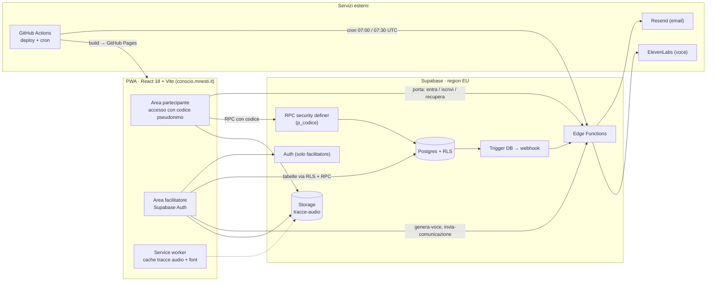
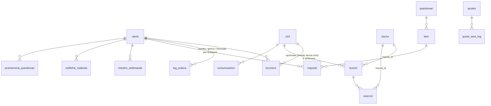

# Conscio · architettura dell'app

Fotografia della struttura al 2/10/2026 (commit `b110be0`, ramo `main`).
Complementare a `docs/progetto.md` (decisioni e registro) e `docs/design-system.md` (stile).

## 1. Vista d'insieme

## 2. Frontend

- **Stack:** React 18, React Router 6 (`HashRouter`, per GitHub Pages), Vite 5, `vite-plugin-pwa` (Workbox), Recharts, `react-speech-recognition` (note vocali), `lamejs` (MP3 in browser), font Source Serif 4 + Public Sans.
- **Provider** (`main.jsx`): `AuthProvider` (facilitatore) → `PartecipanteProvider` (codice, stato percorso, minuti ascolto) → `TonalitaProvider`.
- **Codice partecipante** salvato in `localStorage`; nessuna sessione Auth per i partecipanti.
- **Offline:** tracce da Storage in cache `CacheFirst` (con range requests, priming CORS in `lib/cacheTracce.js`); `sw-navigazione.js` gestisce la navigazione su iOS.

### Route

| Route | Guardia | Pagina |
|---|---|---|
| `/` | — | Splash |
| `/iscrizione`, `/entra`, `/segnala`, `/dati`, `/documenti/:slug` | pubbliche | Iscrizione, Entra, Segnala, IMieiDati, Documento (informative) |
| `/onboarding`, `/questionari` | `SoloRegistrato` | Onboarding, Questionari (T0–T3) |
| `/programma`, `/pratica`, `/checkin`, `/comunicazioni` | `SoloPercorso` | Programma (tracce, informali, note), LogPratica (storico), Checkin, Comunicazioni |
| `/accedi` | — | login facilitatore |
| `/dashboard` | `SoloFacilitatore` | tab Cicli · Questionari · Pratica · Sito |
| `/percorso`, `/percorso/:cicloId/settimana/:n` | `SoloFacilitatore` | Percorso, EditorSettimana |
| `/libreria`, `/genera` | `SoloFacilitatore` | Libreria tracce, GeneraTraccia (ElevenLabs) |

Due "chrome": partecipante (`Nav` + `BarraBassa` + `Footer`) e facilitatore (`AdminChrome`). Un solo design system (`tokens.css`).

### Moduli `src/lib` principali
`supabaseClient` (client + `chiamaPorta`) · `auth` · `partecipante` · `ascolto` (credito ascolto al 90–95%) · `tracce` / `cacheTracce` / `riproduzioneAudio` · `checkin` · `scoring` (PSS-10, FFMQ-I) · `pratica` / `storico` (aderenza, giornate) · `generaVoce` + `audioMp3` · `tono` / `tonalita` / `colori`.

## 3. Modello dati (Postgres)

| Gruppo | Tabelle |
|---|---|
| Identità e consensi | `utenti` (codice, email operativa, ruolo, `consenso_modulo_a`, `consenso_modulo_b`, `consenso_checkin_il`) |
| Organizzazione | `cicli`, `iscrizioni` (screening, modalità `presenza`/`remoto`) |
| Contenuti | `tracce`, `lezioni`, `esercizi` |
| Dati di pratica | `log_pratica`, `checkin_settimanali` |
| Misure | `questionari`, `item`, `risposte` (PSS-10, FFMQ-I · T0–T3) |
| Comunicazione | `comunicazioni`, `notifiche_inattivita`, `promemoria_questionari`, `quotes`, `quote_sent_log` |
| Sistema | `limiti_richieste` (tetti per IP hashato), `splash_sito`, `backfill_collegamenti_tracce` |

**Accesso:** nessuna tabella è leggibile dal client anonimo. Il partecipante passa solo da RPC `security definer` con `p_codice` (es. `programma_del_partecipante`, `registra_ascolto_formale`, `salva_risposte_questionario`, `salva_checkin`, `esporta_dati_del_partecipante`, `resetta_dati_del_partecipante`). Il facilitatore (`is_facilitatore()`) legge tabelle via RLS e usa RPC pseudonime (`risposte_pseudonime`, `log_pratica_pseudonimi`, `segnalazioni_difficili_aperte`).

Lo schema vive in `supabase/schema.sql` + ~45 `migrazione_*.sql` (l'ultimo file che ridefinisce una funzione vince).

## 4. Edge Functions

| Funzione | Innesco | Fa | Servizi |
|---|---|---|---|
| `porta` | app (Entra, Iscrizione, recupero codice, Accedi, Segnala) | rate limit per IP, iscrizione, stato codice, invio codice | Resend |
| `invia-comunicazione` | facilitatore | email ai destinatari del ciclo (o solo remoti) | Resend |
| `invia-incoraggiamento-pratica` | trigger su INSERT `log_pratica` (`tipo='giorno'`) | email con giorno 1–56 + citazione della settimana | Resend |
| `avvisa-segnalazione-checkin` | trigger su `checkin_settimanali` | avviso al facilitatore (solo codice e settimana) | Resend |
| `notifica-inattivita` | cron GitHub 07:00 UTC / bottone facilitatore | avvisi e ritiro iscritti remoti inattivi (15+15 gg) | Resend |
| `promemoria-questionari` | cron GitHub 07:30 UTC | promemoria T3 (apertura e −7 gg) | Resend |
| `genera-voce` | facilitatore (`/genera`) | sintesi vocale delle tracce | ElevenLabs |

Condivisi in `functions/_shared/`: stile e firma email, testo di incoraggiamento, curiosità mindfulness.

## 5. Flussi chiave

1. **Iscrizione:** Iscrizione → `porta` (iscrivi) → `iscrivi_partecipante` → codice via email; Modulo A e B indipendenti.
2. **Ingresso:** codice → `porta` (stato) → `stato_pronto_percorso` → onboarding → T0 → percorso.
3. **Pratica:** ascolto traccia → oltre 90–95% `registra_ascolto_formale` (`log_pratica.tipo='ascolto'`) → «Registra la pratica di oggi» (`tipo='giorno'`, tono + nota) → trigger → email di incoraggiamento.
4. **Check-in settimanale:** consenso separato (`dai_consenso_checkin`) → `salva_checkin` (non modificabile) → se esperienza difficile, avviso al facilitatore.
5. **Questionari:** finestre T0/T1/T2/T3 calcolate lato DB (`timepoint_in_finestra`); punteggi calcolati in `lib/scoring.js`.
6. **Diritti GDPR:** `/dati` → export e reset tramite RPC; `ritira_partecipante` / `ritira_inattivo` lato facilitatore/cron.

## 6. Deploy e configurazione

- **Push su `main`** → `deploy.yml` → build Vite → GitHub Pages (dominio `conscio.mnesti.it`, `public/CNAME`). Chiavi anon in `.env.production` (pubbliche, protette da RLS).
- **Edge Functions** distribuite a mano con `supabase functions deploy`; secret: `RESEND_API_KEY`, `RESEND_FROM`/`EMAIL_FROM`, `CRON_SECRET`, `ENCOURAGEMENT_SECRET`, `CHECKIN_WEBHOOK_SECRET`, `FACILITATORE_EMAIL`, `ELEVENLABS_API_KEY`.
- **Migrazioni SQL** applicate manualmente (SQL editor / MCP) e sempre versionate in `supabase/`.
- **Strumenti:** Cursor e Claude Code sul repo; Claude su claude.ai per analisi, mockup e brief (`docs/brief_*.md`, `docs/mockup/`).

## 7. Aperto (da `docs/progetto.md`)

Non ancora implementati: andamento del check-in (partecipante + scheda facilitatore, RPC `checkin_storico_del_partecipante` proposta), schermata «Il tuo andamento» nei questionari, consenso specifico per citazioni dei partecipanti.
