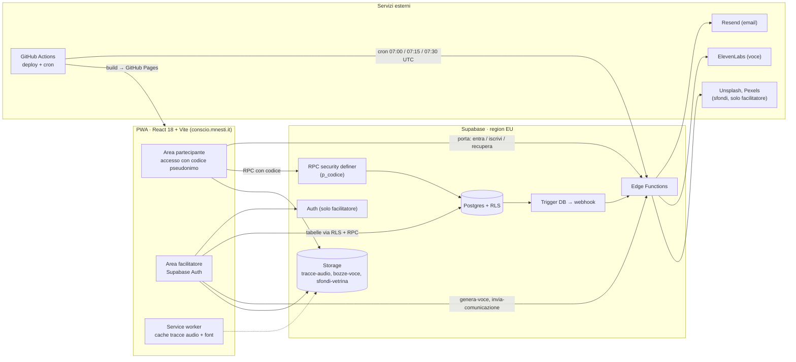
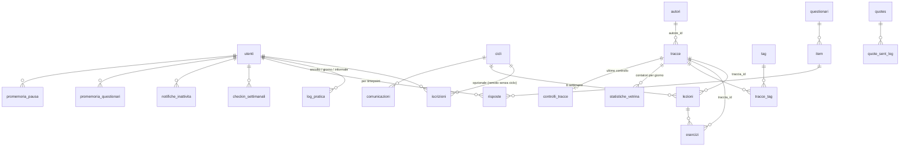

# Conscio · architettura dell'app

Fotografia della struttura al 2/10/2026 (commit `b110be0`, ramo `main`), aggiornata il 12/10/2026 per la vetrina Ascolta, il 13/10/2026 per la navigazione del facilitatore sotto `/admin`, il 14/10/2026 per lo script salvato sulle tracce e il 16/10/2026 per il tappeto di fondo e l’aggancio della voce.
Complementare a `docs/progetto.md` (decisioni e registro) e `docs/design-system.md` (stile).

## 1. Vista d'insieme

```mermaid
flowchart LR
  subgraph Client["PWA · React 18 + Vite (conscio.mnesti.it)"]
    P["Area partecipante<br/>accesso con codice pseudonimo"]
    F["Area facilitatore<br/>Supabase Auth"]
    SW["Service worker<br/>cache tracce audio + font"]
  end

  subgraph Supabase["Supabase · region EU"]
    RPC["RPC security definer<br/>(p_codice)"]
    DB[("Postgres + RLS")]
    ST[("Storage<br/>tracce-audio, bozze-voce, sfondi-vetrina")]
    AUTH["Auth (solo facilitatore)"]
    EF["Edge Functions"]
    TR["Trigger DB → webhook"]
  end

  subgraph Esterni["Servizi esterni"]
    RS["Resend (email)"]
    EL["ElevenLabs (voce)"]
    UN["Unsplash, Pexels<br/>(sfondi, solo facilitatore)"]
    GH["GitHub Actions<br/>deploy + cron"]
  end

  P -->|"porta: entra / iscrivi / recupera"| EF
  P -->|"RPC con codice"| RPC
  F --> AUTH
  F -->|"tabelle via RLS + RPC"| DB
  F -->|"genera-voce, invia-comunicazione"| EF
  RPC --> DB
  P & F --> ST
  SW -.-> ST
  DB --> TR --> EF
  EF --> RS
  EF --> EL
  EF --> UN
  GH -->|"build → GitHub Pages"| Client
  GH -->|"cron 07:00 / 07:15 / 07:30 UTC"| EF
```

## 2. Frontend

- **Stack:** React 18, React Router 6 (`HashRouter`, per GitHub Pages), Vite 5, `vite-plugin-pwa` (Workbox), Recharts, `react-speech-recognition` (note vocali), `lamejs` (MP3 in browser), font Source Serif 4 + Public Sans.
- **Provider** (`main.jsx`): `AuthProvider` (facilitatore) → `PartecipanteProvider` (codice, stato percorso, minuti ascolto) → `TonalitaProvider`.
- **Codice partecipante** salvato in `localStorage`; nessuna sessione Auth per i partecipanti.
- **Offline:** tracce da Storage in cache `CacheFirst` (con range requests). Le copie complete le scrive `lib/cacheTracce.js` (scaricamento a mano dalla card, automatico per la settimana in corso, uno alla volta; richiesta con `copia=1`, esclusa dalla route del service worker; pulizia delle copie che il programma non usa più); `sw-navigazione.js` gestisce la navigazione su iOS.

### Route

| Route | Guardia | Pagina |
|---|---|---|
| `/` | — | Splash |
| `/iscrizione`, `/entra`, `/segnala`, `/dati`, `/documenti/:slug`, `/ascolta`, `/ascolta/:slug` | pubbliche | Iscrizione, Entra, Segnala, IMieiDati, Documento (informative, anche `lettera`), Ascolta |
| `/lettera/conferma?t=`, `/lettera/esci?u=&lista=` | pubbliche, guscio di Ascolta | `pages/Lettera.jsx`: doppia conferma e uscita di «Restiamo in contatto» |
| `/onboarding`, `/questionari` | `SoloRegistrato` | Onboarding, Questionari (T0–T3) |
| `/programma`, `/pratica`, `/checkin`, `/comunicazioni` | `SoloPercorso` | Programma (tracce, informali, note), LogPratica (storico), Checkin, Avvisi (`Comunicazioni.jsx`, solo partecipante) |
| `/accedi` | — | login facilitatore → `/admin/cicli` |
| `/admin/cicli` | `SoloFacilitatore` | `pages/admin/Cicli.jsx`: da fare, KPI, cicli, percorsi da remoto |
| `/admin/cicli/:cicloId/{panoramica,iscritti,programma,pratica,questionari}` | idem | `pages/admin/Ciclo.jsx` (testata + schede) e `pages/admin/ciclo/*`; i dati del ciclo vengono da `useCiclo(cicloId)` |
| `/admin/cicli/:cicloId/programma/settimana/:numero` | idem | `pages/admin/ciclo/EditorSettimana.jsx` |
| `/admin/tracce` (`?traccia=`, `?ciclo=`, `?filtro=da-guardare\|vetrina\|non-controllate`) | idem | `pages/admin/Tracce.jsx` + `SchedaTraccia.jsx` nel `PannelloDettaglio`; controlli con `useControlliTracce` |
| `/admin/tracce/nuova?modo=carica\|genera[&sostituisci=<id>]` | idem | `pages/admin/NuovaTraccia.jsx`, `GeneraDaScript.jsx` (ElevenLabs). Con `sostituisci` riapre `tracce.generazione` e l’audio dei paragrafi in `bozze-voce` |
| `/admin/comunicazioni`, `/admin/sito` | idem | `pages/admin/Comunicazioni.jsx`, `pages/admin/Sito.jsx` |

Redirect delle vecchie rotte: `/dashboard`, `/lezioni` → `/admin/cicli`; `/percorso?ciclo=X` → `/admin/cicli/X/programma`; `/percorso/:id/settimana/:n` → `…/programma/settimana/:n`; `/libreria` → `/admin/tracce`; `/genera` → `/admin/tracce/nuova?modo=genera`; `/controllo-tracce?ciclo=X` → `/admin/tracce?ciclo=X&filtro=da-guardare`; `/comunicazioni` → `/admin/comunicazioni` solo per il facilitatore.

Due "chrome": partecipante (`Nav` + `BarraBassa` + `Footer`) e facilitatore (`AdminChrome`, solo sotto `/admin`: rail a sinistra da 600px, su telefono `BarraVoci`, la stessa barra del partecipante in variante facilitatore; ogni pagina è un `PaginaAdmin`, vedi `docs/framework_layout_facilitatore.md`). Il confine d'errore per pagina sta dentro `AdminChrome`, così guscio e snackbar restano montati cambiando pagina. Un solo design system (`tokens.css`). La barra bassa non include Ascolta. L’indirizzo senza cancelletto `/ascolta` arriva da `public/ascolta/index.html` (e da `public/404.html` per lo slug): entrambi portano a `/#/ascolta`, senza codice.

### Moduli `src/lib` principali
`supabaseClient` (client + `chiamaPorta`) · `auth` · `partecipante` · `ascolto` (credito ascolto al 90–95%) · `vetrina` (pagine pubbliche e scheda del facilitatore; in modalità vetrina il player non accredita la pratica) · `tracce` / `cacheTracce` / `riproduzioneAudio` · `controlloTracce` + `useControlliTracce` (collegamenti, file, ascolto tecnico; esiti salvati) · `cicli` + `useCiclo` (cicli, iscrizioni, KPI, azioni sulle iscrizioni, badge «da fare») · `checkin` · `scoring` (PSS-10, FFMQ-I) · `pratica` / `storico` (aderenza, giornate) · `generaVoce` + `audioMp3` + `tracciaFinale` (file finale: volume, campana tibetana in testa e in coda, MP3 mono; `aggiungiCampane` per i file già pronti) · `tono` / `tonalita` / `colori`.

## 3. Modello dati (Postgres)

```mermaid
erDiagram
  utenti ||--o{ iscrizioni : ""
  cicli ||--o{ iscrizioni : "opzionale (remoto senza ciclo)"
  cicli ||--o{ lezioni : "8 settimane"
  lezioni ||--o{ esercizi : ""
  tracce ||--o{ lezioni : "traccia_id"
  tracce ||--o{ esercizi : "traccia_id"
  autori ||--o{ tracce : "autore_id"
  tracce ||--o{ tracce_tag : ""
  tag ||--o{ tracce_tag : ""
  tracce ||--o{ statistiche_vetrina : "contatori per giorno"
  tracce ||--o| controlli_tracce : "ultimo controllo"
  utenti ||--o{ log_pratica : "ascolto / giorno / informale"
  utenti ||--o{ risposte : "per timepoint"
  questionari ||--o{ item : ""
  item ||--o{ risposte : ""
  utenti ||--o{ checkin_settimanali : ""
  cicli ||--o{ comunicazioni : ""
  utenti ||--o{ notifiche_inattivita : ""
  utenti ||--o{ promemoria_questionari : ""
  utenti ||--o{ promemoria_pausa : ""
  quotes ||--o{ quote_sent_log : ""
```

| Gruppo | Tabelle |
|---|---|
| Identità e consensi | `utenti` (codice, email operativa, ruolo, `consenso_modulo_a`, `consenso_modulo_b`, `consenso_checkin_il`) |
| Organizzazione | `cicli`, `iscrizioni` (screening, modalità `presenza`/`remoto`) |
| Contenuti | `tracce` (con `file_aggiornato_il`, data dell’ultimo file caricato, e `generazione`, la ricetta dello script: modello, voce, paragrafi; l’audio dei paragrafi sta nel bucket `bozze-voce`), `lezioni`, `esercizi`, `autori`, `tag`, `tracce_tag`, `controlli_tracce` (ultimo controllo di file e ascolto tecnico per traccia: stato, esiti, misure, `controllato_il`; solo facilitatore. «Da ricontrollare» quando `controllato_il < file_aggiornato_il`; i collegamenti dipendono dal ciclo e non si salvano) |
| Dati di pratica | `log_pratica`, `checkin_settimanali` |
| Misure | `questionari`, `item`, `risposte` (PSS-10, FFMQ-I · T0–T3) |
| Comunicazione | `comunicazioni`, `notifiche_inattivita`, `promemoria_questionari`, `promemoria_pausa`, `quotes`, `quote_sent_log` |
| «Restiamo in contatto» (separato dallo studio) | `iscritti_lettera` (email `citext`, liste `avviso_ciclo` e `lettera` con data di consenso, `versione_testo`, stato `in_attesa`/`confermato`/`cancellato`, hash del token di conferma con scadenza a 7 giorni, `token_uscita`, `ultimo_ciclo_avvisato`; nessun accesso da anon né authenticated), `lettere_inviate` (storico degli invii, lettura per il facilitatore). Nessun collegamento con `utenti`, `iscrizioni`, codici, risposte o `log_pratica` |
| Agente della lettera | `fonti_lettera` (fonti curate: dominio, feed, area, tipo, peso, attiva/esclusa), `bozze_lettera` (una per settimana: voci, meditazione della vetrina, stato `da_rivedere`/`programmata`/`bloccata`/`in_invio`/`inviata`/`scartata`, `invio_previsto_il`, `motivo_fermo`, `resoconto` con costo stimato), `notizie_lettera` (URL già usati o scartati, per non ripeterli; via dopo 6 mesi), `impostazioni_sito.invio_automatico`. Solo facilitatore via RLS; lo script usa il service role e non legge `iscritti_lettera` |
| Sistema | `limiti_richieste` (tetti per IP hashato), `splash_sito`, `impostazioni_sito` (vetrina spenta di default), `statistiche_vetrina` (conteggi aggregati per traccia e giorno, senza identificativi), `backfill_collegamenti_tracce`, `segnalazioni_problema` (testo collegato all’account, solo per l’avviso di chiusura; niente codice né email verso l’agente; esito `risolta`/`non_risolta`, link alla pull request, `archiviata_il` per «Da fare») |

**Accesso:** nessuna tabella dei partecipanti è leggibile dal client anonimo. Il partecipante passa solo da RPC `security definer` con `p_codice` (es. `programma_del_partecipante`, `registra_ascolto_formale`, `salva_risposte_questionario`, `salva_checkin`, `esporta_dati_del_partecipante`, `resetta_dati_del_partecipante`). Il facilitatore (`is_facilitatore()`) legge tabelle via RLS e usa RPC pseudonime (`risposte_pseudonime`, `log_pratica_pseudonimi`, `segnalazioni_difficili_aperte`, `segnalazioni_problema_da_vedere` + `archivia_segnalazione_problema`: testo, pagina, date ed esito, mai codice né email).

Gli iscritti di «Restiamo in contatto» (avviso del prossimo ciclo e lettera settimanale) non sono partecipanti: `iscritti_lettera` si legge e si scrive solo dalle Edge Function con il service role; il facilitatore vede i conteggi con `lettera_conteggi(p_ciclo_id)` (confermati per lista, in attesa, usciti negli ultimi 30 giorni e, con un ciclo, quanti riceverebbero il suo avviso; mai le email) e lo storico in `lettere_inviate`. `pulisci_iscritti_lettera()` (solo service role) cancella le richieste non confermate scadute; la chiama `porta` a ogni iscrizione.

La vetrina pubblica, spenta finché `impostazioni_sito.vetrina_attiva` non è vero, si legge solo dalle RPC `vetrina_elenco`, `vetrina_traccia`, `vetrina_in_evidenza`, `vetrina_impostazioni` e `vetrina_citazione` (anon, solo tracce con `pubblica`). `vetrina_citazione` restituisce solo testo, autore e libro di una citazione attiva in italiano, la stessa per tutti nello stesso giorno (rotazione stabile su `quotes`), e un insieme vuoto con la vetrina spenta; la tabella `quotes` resta leggibile solo dal service role. I conteggi passano da `porta` (`evento-vetrina`) a `registra_evento_vetrina`, eseguibile solo da `service_role`. Non scrivono in `log_pratica`. `programma_del_partecipante` continua a leggere solo le colonne che già nominava.

Lo schema vive in `supabase/schema.sql` + ~45 `migrazione_*.sql` (l'ultimo file che ridefinisce una funzione vince).

## 4. Edge Functions

| Funzione | Innesco | Fa | Servizi |
|---|---|---|---|
| `porta` (distribuita con `--no-verify-jwt`) | app (Entra, Iscrizione, recupero codice, Accedi, Segnala, conteggi Ascolta, «Restiamo in contatto»), l’agente a fine correzione e i client di posta (uscita con un clic) | rate limit per IP, iscrizione, stato codice, invio codice, avvio analisi segnalazione, chiusura con esito (risolta: email a gestore e partecipante; non risolta: solo al gestore), `evento-vetrina`; `iscrivi_lettera` (5 all’ora per IP, risposta sempre `{ ok: true }`, email di conferma), `conferma_lettera`, `esci_lettera` (anche `POST ?azione=esci_lettera&u=…&lista=…` con `List-Unsubscribe=One-Click`, RFC 8058) | Resend, webhook Cursor |
| `invia-lettera` | facilitatore (Comunicazioni → Lettera settimanale; ciclo in reclutamento → Avviso del prossimo ciclo); job `lettera-agente` del giovedì 15:00 UTC con `x-cron-secret` + `bozza_id` | bozza dell'agente (`bozza_id`): passaggio atomico `programmata → in_invio` (dal job solo se `invio_previsto_il` è passato e l'invio automatico è acceso), una lettera a settimana, HTML da `_shared/letteraSettimanale.ts`, poi `inviata` + `lettera_inviata_id`; altrimenti lettera (`tipo: 'lettera'`) o avviso di un ciclo (`tipo: 'avviso_ciclo'`, `ciclo_id`) agli iscritti confermati; un’email a testa con `POST /emails/batch` (100 per chiamata, 0,6 s tra le chiamate), link di uscita e header `List-Unsubscribe`; con `prova` solo al facilitatore; registra in `lettere_inviate` e, per l’avviso, `ultimo_ciclo_avvisato` | Resend |
| `invia-comunicazione` | facilitatore | email ai destinatari del ciclo (o solo remoti) | Resend |
| `invia-incoraggiamento-pratica` | trigger su INSERT `log_pratica` (`tipo='giorno'`) | email con giorno 1–56 + citazione della settimana | Resend |
| `avvisa-segnalazione-checkin` | trigger su `checkin_settimanali` | avviso al facilitatore (solo codice e settimana), con link a `#/admin/cicli` | Resend |
| `notifica-inattivita` | cron GitHub 07:00 UTC / bottone facilitatore | avvisi e ritiro iscritti remoti inattivi (15+15 gg) | Resend |
| `promemoria-questionari` | cron GitHub 07:30 UTC | promemoria T3 (apertura e −7 gg) | Resend |
| `promemoria-pausa` | cron GitHub 07:15 UTC / bottone facilitatore | email a chi non ascolta una traccia da tre giorni di fila | Resend |
| `genera-voce` | facilitatore (`/admin/tracce/nuova?modo=genera`) | sintesi vocale delle tracce | ElevenLabs |
| `cerca-sfondi` | facilitatore | ricerca foto Unsplash e foto/video Pexels; alla scelta, download Unsplash e copia del file Pexels nel bucket | Unsplash, Pexels |

Condivisi in `functions/_shared/`: `letteraSettimanale.ts` (lettera composta dalla bozza: sezioni, meditazione con miniatura, invito al percorso con i testi di `vetrina_impostazioni`, nota sull'IA, uscita e firma; usata anche da script e scheda), stile e firma email, testo di incoraggiamento, curiosità mindfulness, email di «Restiamo in contatto» (`emailLettera.ts`: conferma, preferenze, piede di uscita, header `List-Unsubscribe`, `VERSIONE_TESTO_LETTERA`).

## 5. Flussi chiave

1. **Iscrizione:** Iscrizione → `porta` (iscrivi) → `iscrivi_partecipante` → codice via email; Modulo A e B indipendenti.
2. **Ingresso:** codice → `porta` (stato) → `stato_pronto_percorso` → onboarding → T0 → percorso.
3. **Pratica:** ascolto traccia → oltre 90–95% `registra_ascolto_formale` (`log_pratica.tipo='ascolto'`) → «Registra la pratica di oggi» (`tipo='giorno'`, tono + nota) → trigger → email di incoraggiamento.
4. **Check-in settimanale:** consenso separato (`dai_consenso_checkin`) → `salva_checkin` (non modificabile) → se esperienza difficile, avviso al facilitatore.
5. **Questionari:** finestre T0/T1/T2/T3 calcolate lato DB (`timepoint_in_finestra`); punteggi calcolati in `lib/scoring.js`.
6. **Diritti GDPR:** `/dati` → export e reset tramite RPC; `ritira_partecipante` / `ritira_inattivo` lato facilitatore/cron.
8. **Lettera settimanale automatica:** giovedì 05:00 UTC il job `lettera-agente` (`scripts/agente-lettera/`) raccoglie da feed RSS, PubMed e ricerca web sui domini di `fonti_lettera` → toglie doppioni e notizie già viste → smistamento (Haiku) → selezione di 3–5 notizie, scrittura e verifica sulla fonte (Sonnet, risposte JSON con schema) → meditazione a caso dalla vetrina, miniatura con play in `sfondi-vetrina/lettera/` → controlli (voci verificate, link 200, date entro 10 giorni, parole vietate, invio automatico acceso) → `bozze_lettera` `programmata` per giovedì 17:00 italiane o `da_rivedere`, email a Dimitri. Alle 15:00 UTC lo stesso job chiama `invia-lettera` con la bozza.
7. **Restiamo in contatto:** box in Ascolta → `porta` (`iscrivi_lettera`) → riga `in_attesa` + email di conferma → `/lettera/conferma` (`conferma_lettera`) → `confermato`. Invii da `invia-lettera`; uscita da `/lettera/esci` (un clic sul pulsante) o dal client di posta (POST one-click a `porta`). Uscendo da tutte le liste resta solo email, stato e data.
8. **Genera da script:** ogni paragrafo è una richiesta a `genera-voce`, in sequenza. Con i modelli che agganciano (v2, v4, Flash) passano gli ultimi 3 ID di richiesta dei paragrafi precedenti e l’inizio del successivo, con un seme unico per la traccia. Gli ID valgono 2 ore: l’editor non manda quelli dei paragrafi generati da più di 110 minuti e avvisa di rigenerare dall’inizio; un paragrafo che torna senza aggancio ha il badge «Senza aggancio» (`agganciato` e `generato_il` nella ricetta, versione 3). Stabilità regolabile su v2 (predefinita 0,62) e v4 (0,85). Il file finale (`lib/tracciaFinale.js`): loudness BS.1770 sulla voce, poi un tappeto di fondo continuo (rumore rosa 80 Hz–4 kHz con seme fisso, `LETTO_DB` −66 dBFS RMS, dissolvenza di 1 s ai bordi) sotto campane, voce e pause, così il suono non va mai a zero; MP3 codificato una volta, a blocchi. `aggiungiCampane` (file caricati) non mette il tappeto.

## 6. Deploy e configurazione

- **Push su `main`** (e ogni mattina alle 05:45 UTC, o a mano) → `deploy.yml` → build Vite, poi `scripts/pagine-condivisione.mjs` scrive `dist/ascolta/<slug>/index.html` per ogni meditazione pubblica, con titolo e immagine per le anteprime dei link → GitHub Pages (dominio `conscio.mnesti.it`, `public/CNAME`). Chiavi anon in `.env.production` (pubbliche, protette da RLS).
- **Edge Functions** distribuite a mano con `supabase functions deploy`; secret: `RESEND_API_KEY`, `RESEND_FROM`/`EMAIL_FROM`, `CRON_SECRET`, `ENCOURAGEMENT_SECRET`, `CHECKIN_WEBHOOK_SECRET`, `FACILITATORE_EMAIL`, `ELEVENLABS_API_KEY`, `CURSOR_AUTOFIX_WEBHOOK_URL`, `CURSOR_AUTOFIX_WEBHOOK_KEY`, `UNSPLASH_ACCESS_KEY`, `PEXELS_API_KEY`.
- **Storage:** `tracce-audio` (pubblico, audio del percorso), `bozze-voce` (privato, solo facilitatore: audio dei paragrafi per rigenerare una traccia, fino a 50 MB a paragrafo) e `sfondi-vetrina` (pubblico, foto fino a 10 MB e video fino a 50 MB; il tetto del bucket è 50 MB). Gli sfondi Unsplash restano sui loro server.
- **Job della lettera** (`.github/workflows/lettera-agente.yml`, giovedì 05:00 e 15:00 UTC): secret GitHub `ANTHROPIC_API_KEY`, `SUPABASE_FUNCTIONS_URL`, `SUPABASE_SERVICE_ROLE_KEY`, `RESEND_API_KEY`, `RESEND_FROM`, `FACILITATORE_EMAIL`, `CRON_SECRET`.
- **Migrazioni SQL** applicate manualmente (SQL editor / MCP) e sempre versionate in `supabase/`.
- **Strumenti:** Cursor e Claude Code sul repo; Claude su claude.ai per analisi, mockup e brief (`docs/brief_*.md`, `docs/mockup/`).

## 7. Aperto (da `docs/progetto.md`)

Non ancora implementati: import da YouTube, andamento del check-in (partecipante + scheda facilitatore, RPC `checkin_storico_del_partecipante` proposta), schermata «Il tuo andamento» nei questionari, consenso specifico per citazioni dei partecipanti. Le pagine `/ascolta` e la scheda nella scheda traccia e in `/admin/sito` ci sono; l’interruttore nasce spento.
