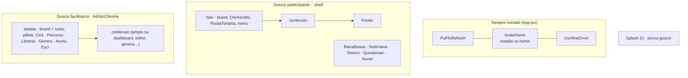

# Conscio · mappa dell'interfaccia

Inventario degli elementi grafici dell'app: gusci, schermate, componenti e pattern ricorrenti, con il
file in cui vivono. Fotografia al 2/10/2026.

**Da leggere prima di ogni re-design o integrazione**, insieme a:
- `docs/design-system.md` → *come* appare (token, tipografia, classi base `.btn`, `.card`, `.field`, `.dialogo`…);
- questo file → *cosa* esiste e *dove* (quale schermata usa quale blocco);
- `docs/architettura.md` → dati e funzioni dietro ogni schermata.

## 1. Gusci (chrome)

| Guscio | File | Note |
|---|---|---|
| Partecipante | `Nav.jsx`, `BarraBassa.jsx`, `Footer.jsx` | `Nav` mostra voci diverse se c'è un codice attivo; `BarraBassa` è la navigazione principale su telefono |
| Facilitatore | `AdminChrome.jsx` (+ `styles/admin.css`) | Attivo quando c'è la sessione facilitatore, tranne su `/` e `/accedi`; prop `ampio` per le pagine larghe |
| Nessuno | `Splash.jsx` | Contenuto da `splash_sito`, modificabile dalla tab Sito |

## 2. Schermate e blocchi che le compongono

### Pubbliche e ingresso
| Schermata | Route | Blocchi |
|---|---|---|
| Splash | `/` | hero + CTA (`.splash-*`) |
| Iscrizione | `/iscrizione` | presentazione percorso e cicli, modulo con consensi A e B separati, `Disclaimer`, `BoxCodicePrivacy`, conferma con codice copiabile (`ConfermaIscrizione`) |
| Entra | `/entra` | campo codice, `BoxCodicePrivacy`, `Disclaimer`, «Recupera il codice» |
| Documento | `/documenti/:slug` | informative a sezioni numerate (`.doc`) |
| I tuoi dati | `/dati` | `IdentitaCodice`, card Export e Reset, `DialogConferma` |
| Segnala | `/segnala` | `SegnalaProblema` (con campo trappola anti-spam) |
| Accedi | `/accedi` | login facilitatore (card + 2 campi) |

### Partecipante (dopo il codice)
| Schermata | Route | Blocchi |
|---|---|---|
| Onboarding | `/onboarding` | Benvenuto, `AvvisoDatiPseudonimi`, atteggiamenti della mindfulness (card), `CampoNota` |
| Questionari | `/questionari` | flusso a passi `scelta → avviso → domanda → esito`; `ScalaLikert`, `Disclaimer`, esito con `IndicatoreOrientamento` (non clinico) |
| Settimana | `/programma` | intestazione settimana, `CalendarioPratica`, «Da fare ogni giorno» con `CardTracciaAudio` (formali), `GuidaMeditazione`, «Pratiche informali» (spunta), «Annotazioni del giorno» con `TonoEsperienza` + `CampoNota`, `VoceLog`, `CardCheckin`, invito all'incontro remoto |
| Storico | `/pratica` | `StoricoGiornate` (contatori + una riga per giornata: barra minuti colorata dal tono, `TonoIcon`, nota) |
| Check-in | `/checkin` | consenso separato → cursori (stress, sonno, presenza) → ostacoli → momenti difficili → grazie / già registrato |
| Avvisi | `/comunicazioni` | elenco comunicazioni del partecipante, `StatoVuoto` |

Fallback comune: senza codice in memoria le pagine mostrano `ChiediCodice`; durante il caricamento `StatoAttesa`.

### Facilitatore
| Schermata | Route | Blocchi |
|---|---|---|
| Dashboard · Cicli | `/dashboard` | card KPI (`.dash-kpi-card`), nuovo ciclo, tabella cicli con date/stato, iscrizioni con filtri (Idoneo, In presenza, Da remoto), segnalazioni difficili aperte |
| Dashboard · Questionari | idem | grafici per strumento (Recharts `LineChart`), `BarraRange`, nota sull'uso dei dati |
| Dashboard · Pratica | idem | `SchedaPratica`: quattro numeri, barre per giorno colorate per tono, mappa del percorso (scala minuti), tabella informali |
| Dashboard · Sito | idem | `EditorSplash` |
| Percorso | `/percorso` | elenco cicli → 8 settimane |
| Editor settimana | `/percorso/:id/settimana/:n` | lezione + esercizi formali/informali, `LibreriaTracce` (selettore traccia), dialoghi di modifica |
| Libreria | `/libreria` | ricerca, griglia di `CardTracciaAudio`, azioni (ascolta, modifica, sostituisci, elimina), date creazione/modifica |
| Genera | `/genera` | script → paragrafi, scelta modello/voce/velocità del parlato, pause, ascolto per paragrafo, salva in libreria |
| Avvisi | `/comunicazioni` | composizione comunicazione (ciclo / solo remoti), storico invii, card «Inattività · solo da remoto» |

## 3. Catalogo componenti (`src/components`)

| Famiglia | Componenti |
|---|---|
| Guardie (nessuna UI propria) | `SoloRegistrato`, `SoloPercorso` (blocca finché onboarding + T0 non sono completi), `SoloFacilitatore` |
| Stati di sistema | `StatoAttesa` (anello), `StatoVuoto` (titolo + testo), `ConfineErrori` (card errore + segnalazione) |
| Accesso e identità | `ChiediCodice`, `BoxCodicePrivacy`, `IdentitaCodice` |
| Avvisi, consenso, privacy | `Disclaimer` (`.avvertenza`, chiudibile), `AvvisoDatiPseudonimi`, `.disclaimer` (classe) |
| Modali e inviti | `DialogConferma` (`.dialogo`), `InvitoHome` (installazione PWA), `InvitoCheckin` (modale a ogni apertura finché manca il check-in) |
| Audio e pratica | `CardTracciaAudio` (player, eyebrow, stato «ascoltata»), `GuidaMeditazione` (carosello di posture: `assets/guida/*.png`), `LibreriaTracce`, `CalendarioPratica`, `VoceLog` |
| Tono della giornata | `TonoEsperienza` (scelta), `TonoIcon` (faccina SVG), `TonoMini` (etichetta) |
| Input | `CampoNota` (testo + dettatura), `ScalaLikert`, `SegnalaProblema` |
| Dati e grafici | `SchedaPratica`, `StoricoGiornate`, `IndicatoreOrientamento`, `OreAscolto` |
| Personalizzazione | `RuotaTonalita` (ruota l'accento e il fondo, vedi `lib/tonalita.js`) |
| Admin | `AdminChrome`, `EditorSplash` |
| Navigazione | `Nav`, `BarraBassa`, `Footer`, `PullToRefresh` |

**Non usati oggi:** `GraficoAndamentoPratica.jsx`, `TracciaGuidata.jsx`. Prima di riprenderli verifica che seguano il design system, altrimenti eliminali.

**Sottocomponenti locali** (definiti dentro la pagina, non riusabili così come sono): `Consenso`, `Cursore`, `GiaRegistrato` (Checkin); `TaskFormale`, `AnnotazioniGiorno`, `VuotoProgramma` (Programma); `EditorDialogo`, `SelettoreTraccia` (EditorSettimana); `AdminDialogo` e le icone `Icona*` (Libreria, Iscrizione). Se un secondo file ne ha bisogno, spostali in `components/`.

## 4. Pattern ricorrenti

- **Flusso a passi**, una cosa alla volta: Questionari, Check-in, Iscrizione, Onboarding. Ogni passo è una card con titolo serif, testo e azioni in fondo (`.azioni`).
- **Card numerica / card con titolo / tabella**: definite in `design-system.md`, usate da Dashboard, SchedaPratica e Storico.
- **Fallback a tre stati** in ogni pagina dati: attesa (`StatoAttesa`) → vuoto (`StatoVuoto` o `.card-vuota`) → errore (`.avviso-errore`).
- **Conferme distruttive**: sempre `DialogConferma` con `.btn-pericolo`; il pulsante che la apre è `.btn-ghost.is-pericolo`.
- **Linguaggio**: «pratica», «percorso», «programma»; mai termini clinici. Gli esiti dei questionari si mostrano come posizione su una scala, senza interpretazione.
- **Privacy visibile**: dove compare il codice c'è sempre una spiegazione (`BoxCodicePrivacy`, `AvvisoDatiPseudonimi`); il facilitatore vede note e codici solo dove serve (segnalazioni), altrove solo aggregati.

## 5. Layout e responsive

- Mobile first. Breakpoint usati in `styles.css`: 720px (il più frequente), 860px, 960px; `max-width: 640px` solo per eccezioni. `prefers-reduced-motion` è rispettato.
- Partecipante: colonna singola in `.shell`; su telefono le voci principali passano in `BarraBassa` (fissa in basso) e `Nav` tiene solo le secondarie (classe `body.has-barra-bassa`).
- Facilitatore: `AdminChrome` con contenuto stretto, o largo per dashboard, editor settimana, questionari, pratica, avvisi e genera (`pagineAdminAmpie` in `App.jsx`).
- CSS: `styles/tokens.css` (valori), `styles.css` (componenti e pagine, ~5.200 righe, prefissi per pagina: `.dash-`, `.storico-`, `.checkin-`…), `styles/admin.css` (solo layout dell'area facilitatore).

## 6. Checklist per re-design e integrazioni

1. Trova la schermata nella sezione 2 e i componenti coinvolti nella sezione 3.
2. Riusa un componente o una variante esistente prima di crearne uno nuovo (`design-system.md`, «Componenti condivisi»).
3. Solo token: nessun colore, font o raggio scritto a mano. Se cambi un token, aggiorna anche `lib/colori.js` e `_shared/stileEmail.ts`.
4. Prevedi i tre stati (attesa, vuoto, errore) e il fallback `ChiediCodice` per le pagine del partecipante.
5. Controlla i due gusci se tocchi navigazione o larghezze.
6. Mockup in `docs/mockup/`, istruzioni in `docs/brief_*.md`; a lavoro fatto aggiorna questo file e il registro in `docs/progetto.md`.
